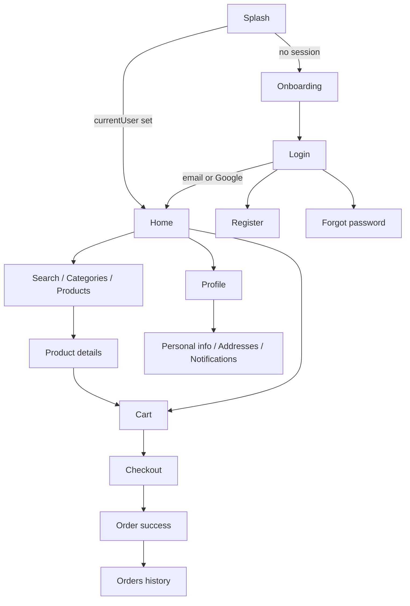

# SmartPharmacy

A Flutter mobile app for browsing pharmacy products, managing a cart, and placing orders. Built as a graduation project (`graduated_project`) with Firebase Authentication, Cloud Firestore, and a remote product catalog.

[](https://flutter.dev)
[](https://dart.dev)
[](https://firebase.google.com)
[](https://bloclibrary.dev)

---

## Overview

Buying over-the-counter medicines and health products is still often a fragmented experience: users need to find a product, understand dosage and stock, and complete checkout without a consistent mobile flow.

SmartPharmacy is a client-side pharmacy shopping app. It is aimed at end users who want to:

- Discover medicines and healthcare products by category
- Inspect product details (description, dosage, stock, rating)
- Add items to a per-user cart
- Place an order and review order history
- Manage a simple profile (display name, addresses, notifications UI)

This is an **academic / portfolio project**, not a licensed pharmacy or a production storefront. Product data comes from a Mockachino REST endpoint. Checkout records orders in Firestore; it does not connect to a real payment processor or pharmacy inventory system.

**Pubspec name:** `graduated_project`  
**Android label:** SmartPharmacy  
**Version:** `1.0.0+1`

---

## Project Status

**Academic project / portfolio application** — the main shopping loop (auth → browse → cart → checkout → history) is implemented. Some profile surfaces (notifications, saved addresses, a second order-history screen) currently use **in-memory sample data**. Menu entries for Saved Prescriptions and Help & Support are present in the UI but are not wired to screens.

---

## Key Features

### Authentication
- Email/password sign-in via Firebase Auth
- Registration with full name, phone, email, and password (name/email/password are persisted through Firebase Auth; the phone field is validated in the form)
- Email verification is sent on register; email login checks `emailVerified`
- Google Sign-In (`google_sign_in` + Firebase credential)
- Password reset via `sendPasswordResetEmail`
- Session-aware splash: signed-in users skip onboarding and go to Home
- Logout (Firebase Auth + Google Sign-In)

### Catalog and search
- Product list fetched with Dio from Mockachino
- Home: delivery address header, promo banner, category chips, popular products
- Full category grid and category detail lists
- Search by product name, with sort options (A–Z, Z–A, price low/high)
- Product details: images, price (USD), discount display, stock, description, dosage, favorite toggle
- Add / increment / decrement cart quantity from list and detail screens

### Cart and checkout
- Firestore-backed cart under `Users/{uid}/Cart_Products`
- Live cart badge on the bottom navigation bar
- Empty-cart state, subtotal, hardcoded delivery fee, total
- Checkout: delivery address card, payment method selection (Credit Card / PayPal / Cash on Delivery — UI only), order summary
- Place Order writes cart items to `Orders_History` (batch) and clears the cart
- Success screen with navigation to orders or continued shopping

### Orders
- Orders tab loads history from `Users/{uid}/Orders_History`
- Reorder and view-details actions on history cards
- Loading, error, and empty (“No History”) states

### Profile
- Header with Firebase display name and email
- Camera-based profile photo via `image_picker` (local path)
- Personal information form (name stored on Firebase user; phone/gender/DOB held in cubit state)
- Saved addresses screen (sample addresses)
- Notifications screen (sample notifications)
- Navigation to the Firestore-backed Orders tab

### App shell
- Splash with brand mark and progress bar
- Two-page onboarding (“Find Your Medicine”, “Fast Doorstep Delivery”)
- Bottom navigation: Home, Cart, Orders, Profile

---

## Demo

Add a walkthrough video (screen recording of the shopping flow) and replace the link below.

<p align="center">
  <a href="YOUR_VIDEO_LINK_HERE">
    
  </a>
</p>

<p align="center">
  <strong><a href="YOUR_VIDEO_LINK_HERE">▶ Watch SmartPharmacy Demo</a></strong><br>
  <sub>Replace <code>YOUR_VIDEO_LINK_HERE</code> with a YouTube, Google Drive, or GitHub-hosted video URL.</sub>
</p>

Suggested recording: splash → onboarding → register/login → home → product details → cart → checkout → order success → orders → profile.

---

## Application Screenshots

Screens captured from the running Android build. Paths are relative to this repository.

### Launch and onboarding

<p align="center">
  
  
  
</p>

<p align="center"><sub>Splash · Find Your Medicine · Fast Doorstep Delivery</sub></p>

### Authentication

<p align="center">
  
  
  
</p>

<p align="center"><sub>Sign in · Create account · Password reset</sub></p>

### Browse and catalog

<p align="center">
  
  
  
</p>

<p align="center"><sub>Home · Categories · Search results</sub></p>

<p align="center">
  
  
  
</p>

<p align="center"><sub>Product list · Medicine details · Home with cart badge</sub></p>

### Cart, checkout, and orders

<p align="center">
  
  
  
</p>

<p align="center"><sub>Empty cart · Cart with quantity controls · Checkout</sub></p>

<p align="center">
  
  
</p>

<p align="center"><sub>Order placed · Orders tab</sub></p>

### Profile

<p align="center">
  
  
  
</p>

<p align="center"><sub>Profile · Personal information · Saved addresses</sub></p>

---

## Technology Stack

| Layer | What the project actually uses |
| --- | --- |
| Client | Flutter (SDK constraint in lockfile: Flutter ≥ 3.38.4), Dart `^3.11.4` |
| UI | Material, Google Fonts (Inter), `flutter_screenutil` (design size 390×890), `cached_network_image` |
| State | `flutter_bloc` / `bloc` Cubits, `equatable` |
| Auth | Firebase Authentication, Google Sign-In |
| Database | Cloud Firestore (user cart, favorites, order history) |
| Networking | Dio against a Mockachino JSON API |
| Device | `image_picker` (camera) for profile photo |
| Bootstrap | `firebase_core`, FlutterFire-generated `lib/firebase_options.dart` |
| Tooling | `flutter_lints`, `flutter_launcher_icons` |

**Declared in `pubspec.yaml` but not referenced from `lib/`:** `provider`, `sqflite`, `firebase_database`, `flutter_svg`, `font_awesome_flutter`. They are not part of the running architecture.

Firebase Realtime Database appears in `firebase_options.dart` / `google-services.json` because the Firebase project is configured for it; application code does not call `firebase_database`.

---

## Architecture

The app is **feature-folder Cubit**, not a full Clean Architecture split.

- **UI** widgets and screens call Cubits through `BlocProvider` / `context.read`.
- **Cubits** own form controllers, loading/success/error states, and talk to Firebase Auth, Firestore, or Dio **directly**. There is no repository or use-case layer.
- **Models** live next to the feature (`PharmacyProducts` in Search & Discovery; profile models under `features/profile/*/data`).
- **Navigation** is imperative `Navigator` + `MaterialPageRoute`. There is no named-route table or `go_router`.
- **App-wide state:** `main.dart` provides a root `ProductCubit`. Several screens create **additional** `ProductCubit` instances (Home, Search, Products, Category), so catalog/cart state is not a single shared instance everywhere.
- **Profile** is closer to a `ui` / `logic` / `data` layout, but addresses, notifications, and `OrdersCubit` load **hardcoded lists** after a short delay rather than Firestore.

Data flow for catalog and cart:

```text
UI  →  ProductCubit  →  Dio (Mockachino) | Firestore Users/{uid}/...
UI  ←  Cubit state / StreamBuilder snapshots
```

Auth flow:

```text
LoginCubit / RegisterCubit / ForgetPasswordCubit  →  FirebaseAuth
Splash  →  currentUser != null ? Home : Onboarding
```

This is an honest, readable structure for a student project: concerns are grouped by screen area, Cubits keep business logic out of most widgets, and Firebase access is centralized in a few cubits — without claiming dependency inversion or a domain layer that does not exist.

---

## Project Structure

```text
graduated_project/
├── lib/
│   ├── main.dart
│   ├── firebase_options.dart          # FlutterFire options (Android / iOS / Web)
│   ├── core/theme/app_colors.dart
│   ├── Splash Screen and Onboarding/
│   │   ├── view/                      # splash, onboarding
│   │   ├── widgets/                   # onboarding pages
│   │   └── contolers/cubit/
│   ├── User Authentication/
│   │   ├── view/                      # login, sign_up, forget_password
│   │   └── contolers/cubit/
│   ├── Search & Discovery/
│   │   ├── view/                      # home shell, search, categories, details
│   │   ├── widgets/                   # product cards, cart controls
│   │   ├── models/product_model.dart
│   │   └── contolers/cubit/product_cubit.dart
│   ├── cart_checkout/view/            # cart, checkout, order success
│   ├── History/view/history.dart      # Firestore order history (Orders tab)
│   └── features/profile/
│       ├── logic/                     # ProfileCubit
│       ├── ui/screens/                # profile, personal info
│       ├── addresses/
│       ├── notifications/
│       └── orders/                    # sample OrderModel list (not the Orders tab)
├── assets/                            # icons, illustrations
├── assets/images/
├── android/                           # applicationId: com.example.graduated_project
├── ios/
├── web/
├── test/widget_test.dart
├── firebase.json
└── docs/screenshots/                  # README images
```

---

## Application Flow



Bottom navigation inside `Home`: index `0` Home, `1` Cart, `2` Orders (`History`), `3` Profile.

---

## Setup and Installation

### Prerequisites

- Flutter **3.38.4** or newer (from `pubspec.lock`)
- Dart **3.11.4** or newer (`pubspec.yaml` `environment.sdk`)
- Android Studio or VS Code with the Flutter plugin
- A Firebase project (the repo is wired to project id `depigraduationproject`)
- For Google Sign-In: SHA-1/SHA-256 of your debug/release keystore registered in Firebase, matching `android/app/google-services.json`

Supported in `DefaultFirebaseOptions`: **Android, iOS, Web**. macOS, Windows, and Linux throw `UnsupportedError`.

### Run locally

```bash
git clone <YOUR_REPO_URL>
cd graduated_project
flutter pub get
flutter run
```

Targets:

```bash
flutter run -d android
flutter run -d chrome
```

Icons (optional, after changing `assets/images/Logo Container.png`):

```bash
dart run flutter_launcher_icons
```

---

## Configuration and Secrets

Do **not** paste API keys into this README.

| File | Role |
| --- | --- |
| `lib/firebase_options.dart` | Client Firebase options (generated by FlutterFire) |
| `android/app/google-services.json` | Android Firebase + Google Sign-In clients |
| `firebase.json` | FlutterFire platform mapping |

There is **no** `.env` file. There is **no** `GoogleService-Info.plist` in the tree; iOS still has options in `firebase_options.dart`, but a full iOS rebuild typically needs the plist from FlutterFire.

To point the app at **your** Firebase project:

1. Create a Firebase app (Android package `com.example.graduated_project`, or change the application id).
2. Enable Email/Password and Google sign-in.
3. Create Firestore in production or test mode and lock it down with rules (see Security).
4. Run FlutterFire: `flutterfire configure`
5. Replace `google-services.json` / `firebase_options.dart`.
6. Enable Google Sign-In OAuth clients and SHA fingerprints.

Client Firebase API keys in this repo are the usual public-client keys. Restrict them in Google Cloud (Android app restriction, HTTP referrers for web). Do not commit service-account JSON or CI secrets.

---

## Firebase and Backend

### Firebase Authentication
Email/password register and login, verification email, password reset, Google credential sign-in, `updateProfile` for display name (and photo URL on personal-info save), `signOut`.

### Cloud Firestore
Per authenticated user:

```text
Users/{uid}/Cart_Products/{productId}
Users/{uid}/Fav_Products/{productId}
Users/{uid}/Orders_History/{autoId}
```

Cart quantity uses `FieldValue.increment`. Checkout and cart-clear use batched writes. Several widgets listen with `StreamBuilder` for live cart and favorite state.

### Product API
`ProductCubit.fetchProducts()`:

```text
GET https://www.mockachino.com/e1c9e45a-271f-4e/users
```

JSON is mapped through `Autogenerated` / `PharmacyProducts` (`pharmacy_products` array, prices, categories, images, stock, side effects, etc.).

### Not used in Dart
Firebase Cloud Messaging, Cloud Functions, Analytics, Storage, Realtime Database.

---

## Engineering Practices

Visible in the current code:

- Feature folders (auth, catalog, cart, profile) instead of a single `screens/` dump
- Cubit for async work and UI states (`Loading` / `Success` / `Error` on products and auth)
- Shared product widgets (`product_card`, add/remove quantity, search bar)
- Form validation on login, register, and forgot-password fields
- Firestore scoped by `FirebaseAuth.instance.currentUser.uid`
- `StreamBuilder` for cart counts and favorites
- Screenutil scaling from a phone design size
- `flutter_lints` via `analysis_options.yaml`
- Loading indicators on catalog, cart, profile, and checkout streams
- Empty states on cart and order history

Gaps that are also visible (and worth knowing before a review):

- No repository abstraction; Cubits depend on Firebase/Dio
- Duplicate `ProductCubit` instances can desync UI
- Profile addresses/notifications/`OrdersCubit` are mock data
- Default `test/widget_test.dart` still tests a counter, not this app
- Folder name `contolers` is misspelled throughout auth/catalog/splash

---

## UI / UX

- Teal primary (`#2D9F75` / related greens) on white and light gray (`#F9FAFB`) surfaces
- Inter via `google_fonts`
- Rounded cards, green filled CTAs, outlined secondary actions
- Bottom navigation with a red cart quantity badge
- Splash gradient and “ENCRYPTED & SECURED” label (branding copy, not a security audit)
- Password visibility toggles, Google button on login
- Promo banner and category icon row on Home
- Checkout payment radios and a disabled Place Order when total is `0`

There is no `l10n` / ARB localization. Accessibility is mostly default Material (no custom semantics layer). Responsive work is Screenutil on a phone canvas, not a separate tablet layout.

---

## Testing

| Kind | Status |
| --- | --- |
| Unit tests | None beyond the template file |
| Widget tests | `test/widget_test.dart` is the Flutter counter smoke test; it does not match SmartPharmacy |
| Integration tests | Not present |

Run the existing file with:

```bash
flutter test
```

Expect it to fail or be meaningless until it is rewritten against `MyApp` / `Splash`.

---

## Performance

No benchmark numbers are recorded in this repository. Practical techniques in code: `cached_network_image` for catalog photos, Firestore snapshots instead of polling the cart, and batched writes on checkout/clear-cart. Do not treat that as measured FPS or crash-free data.

---

## Security

- Authentication is required for cart, favorites, and history (uid-based paths).
- Email/password login requires a verified email on the cubit path.
- Passwords are handled by Firebase Auth (not stored in app code).
- Register/login forms validate presence, email shape, and password length (6–20 on login).

This is **not** a claim that the app is production-hardened:

- Firestore **security rules are not in this repo**. Without rules that check `request.auth.uid == userId`, client paths are not enough.
- Payment methods on checkout are not processed.
- `google-services.json` and `firebase_options.dart` are committed (normal for FlutterFire; restrict keys).
- Camera usage is not declared in `ios/Runner/Info.plist`; Android camera permission is not listed in the main `AndroidManifest.xml`.
- `INTERNET` is declared on debug/profile manifests only (release may still get it from plugins — verify before store release).

---

## Future Improvements

Distinct from what already ships:

- Dedicated tests (cubit unit tests, widget tests for login/cart, a golden or integration pass)
- CI (`flutter analyze` + `flutter test` on GitHub Actions)
- A single shared `ProductCubit` (or a catalog repository) so Home/Search/Cart stay consistent
- Persist addresses, notifications, and profile fields in Firestore instead of sample lists
- Wire Saved Prescriptions and Help & Support, or remove the dead menu rows
- Real payment and order-status pipeline (the success screen uses a fixed order id string)
- Named routing and a thinner `Home` shell
- iOS `GoogleService-Info.plist`, camera usage strings, and release signing
- Firestore rules + App Check
- Replace Mockachino with a catalog you control, including offline cache if needed

---

## License

No `LICENSE` file is present. All rights remain with the authors until a license is added. If you fork this for coursework, add an SPDX license before publishing.

---

## Author

**Marwan Yousef** — primary commit author on this repository (`marwanyousef`).

Additional commits: **Abdulrahman** (`Abdulrahman2555`).

```text
Email:          YOUR_PUBLIC_EMAIL_HERE
GitHub:         YOUR_GITHUB_PROFILE_HERE
LinkedIn:       YOUR_LINKEDIN_URL_HERE
```

Replace the placeholders with the profiles you want on GitHub. Do not commit private credentials.

---

## Acknowledgments

- Flutter and Dart
- Firebase (Auth, Firestore)
- [Mockachino](https://www.mockachino.com) for the sample product JSON used during development
